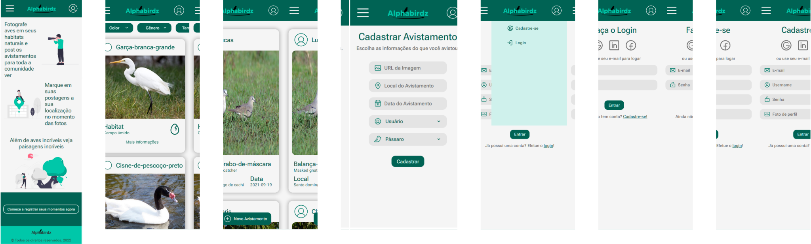

# Alphabirdz Angular

### iniciando o projeto

Considerando que já tenha instalados o gerenciador de pacotes NPM, o Angular e o Angular CLI, siga os passos abaixo.

#

- Clone o repositório.
```
git clone https://gitlab.com/alphabirdz/alphabirdz-angular.git
```
- Entre no diretório.
```
cd alpabirdz-angular
cd alpabirdz
```
- Instale as dependencias necessarias.
```
npm install
```
- Inicie o servidor
```
ng serve
```

#

## Projeto Alphabirdz
É um cliente desenvolvido com o framework Angular em TS, que faz o consumo de uma API desenvolvida em java.
O propósito é q seja possivel cadastrar avistamentos de aves, indicando qual ave, onde e quando ela foi avistada, também será possível consultar um banco de dados de pássaros, que contenha nomes, habitats, cores predominantes, entre outras características.

#

## Interface / Protótipo
#### Landing page


#### Guide page


#

## Autores

- [Ariel Q.](https://gitlab.com/quaresmina)
- [Jullie P.](https://gitlab.com/julliepx)
- [Kalebe N.](https://gitlab.com/kalNascimento)

#

